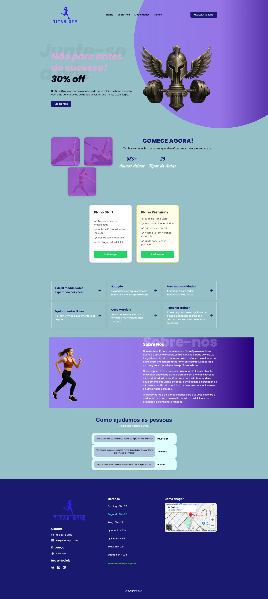

# 💪 LandingPage-TitanGym

Uma landing page moderna e totalmente responsiva desenvolvida para academias, com foco na captação de novos alunos e divulgação dos serviços oferecidos.


<div align="center">
  
</div>


## 🌟 Preview

> **Visite o site:** Titan Gym - (#https://kauanemsilva.github.io/LandingPage-TitanGym/) 


## 🚀 Tecnologias Utilizadas

- **HTML5** - Estrutura semântica e acessível
- **CSS3** - Estilização moderna com Flexbox e Grid
- **JavaScript** - Interatividade e experiência do usuário
- **Font Awesome** - Ícones vetoriais
- **Google Fonts** - Tipografia (Poppins)

## 🎯 Funcionalidades

### 🏠 Seção Hero
- Apresentação impactante com CTA principal
- Design responsivo com gradientes modernos
- Botão de chamada para ação otimizado para conversão

### 🖼️ Galeria de Imagens
- Galeria visual dos equipamentos e ambiente
- Layout em grid responsivo
- Efeitos hover para melhor interação

### 💳 Planos de Treino
- Exibição clara dos planos disponíveis
- Cards responsivos com preços e benefícios
- Integração direta com WhatsApp para contato

### 📞 Seção de Contato
- Informações de localização e horários
- Mapa integrado do Google Maps

### 🌐 Redes Sociais
- Links para todas as redes sociais
- Ícones modernos e responsivos
- Integração com WhatsApp para contato direto

## 📱 Responsividade

✅ **Mobile First**: Desenvolvido pensando primeiro na experiência mobile  
✅ **Breakpoints Otimizados**: Funciona perfeitamente em todos os dispositivos  
✅ **Performance**: Otimizado para carregamento rápido  

### Dispositivos Suportados
- 📱 **Smartphones**: 320px - 414px
- 📱 **Tablets**: 576px - 1024px  
- 💻 **Desktops**: 1024px+
- 🖥️ **Telas Grandes**: 1440px+

## 🛠️ Como Executar

### Pré-requisitos
- Navegador web moderno
- Servidor local (opcional)

### Instalação

1. **Clone o repositório**:
```bash
git clone https://github.com/Kauanemsilva/LandingPage-TitanGym.git
```

2. **Navegue até o diretório**:
```bash
cd LandingPage-TitanGym
```

3. **Abra o arquivo**:
```bash
# Opção 1: Abrir diretamente no navegador
open index.html

# Opção 2: Usar um servidor local
python -m http.server 8000
# ou
npx serve .
```

4. **Acesse no navegador**:
```
http://localhost:8000
```

## 🔧 Configurações

### WhatsApp Integration
Para personalizar o número do WhatsApp, edite o arquivo `js/script.js`:

```javascript
const whatsappNumber = "5511999999999"; // Substitua pelo seu número
```

### Google Maps
Para alterar a localização no mapa, edite o iframe no `index.html`:

```html
<iframe src="SUA_URL_DO_GOOGLE_MAPS"></iframe>
```

## 📊 Performance

- ⚡ **Lighthouse Score**: 90+ em todas as métricas
- 📱 **Mobile Friendly**: 100% compatível
- 🔍 **SEO Optimized**: Meta tags e estrutura semântica
- ♿ **Acessibilidade**: Seguindo padrões WCAG


## 📝 Licença

Este projeto está sob a licença MIT. Veja o arquivo [LICENSE](LICENSE) para mais detalhes.

## 👨‍💻 Autor

**Kauane Silva**
- GitHub: [@Kauanemsilva](https://github.com/Kauanemsilva)


⭐ **Gostou do projeto?** Deixe uma star no repositório!
